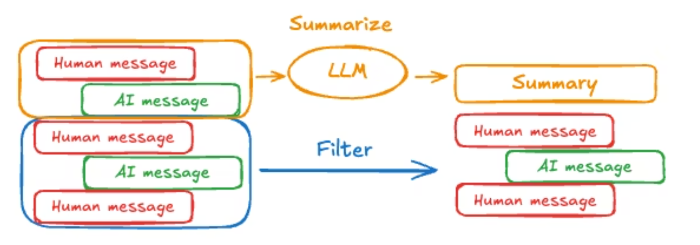

# LangChain Core

## Models 模型

#### 基本初始化与参数

```python
import os
from langchain.chat_models import init_chat_model

model = init_chat_model(model, api_key, temperature,
                        max_tokens, max_retries, timeout,  # 基础参数
                       )
response = model.invoke("Why do parrots talk?")
```

#### 输出方式

```python
response = model.invoke(conversation)  # 完整输出
print(response)

full = None  # None | AIMessageChunk
for chunk in model.stream(conversation):  # 流式输出
    full = chunk if full is None else full + chunk
    print(full.text)  # token 块
print(full.content_blocks)  # 最终完整 Message 结构

responses = model.batch(["1", "2", "3"])  # batch 输出
for response in responses:
    print(response)  # 全部生成完才输出
    
for response in model.batch_as_completed(["1", "2", "3"]
    #  config={'max_concurrency': 5,}  # 控制并发
):
    print(response)  # 生成一条输出一条
```

#### 工具调用

```python
model.bind_tools([get_weather],
                tool_choice="any",  # 强制工具调用
                parallel_tool_calls=False,  # 自动并行根据调用，默认为 True
                ) 
```

#### 结构化输出

```python
from pydantic import BaseModel, Field  # pydantic 模式
class sample1(BaseModel):
    """工具说明"""
    字段名: str = Field(..., description="字段描述")

from typing_extensions import TypedDict, Annotated  # TypedDict 模式（推荐）无需运行验证
class sample2(TypedDict):
    """工具说明"""
    字段名: Annotated[str, ..., "字段描述"]   

import json  # json 模式
sample3 = {}
model_with_structure = model.with_structured_output(sample1/sample2/sample3,
                                                   method="sample3"  # 仅 json 需要
                                                   )
response = model_with_structure.invoke("")
```

#### 速率限制

```python
from langchain_core.rate_limiters import InMemoryRateLimiter
rate_limiter = InMemoryRateLimiter(
    requests_per_second=0.1,  # 默认1s 1请求，这里是10s 1请求
    check_every_n_seconds=0.1,  # 发起请求间隔时间，默认1s 1间隔，这里是0.1s
    max_bucket_size=10,  # 容纳最大请求数量（防止并发爆炸）
)
model = init_chat_model(..., # 基础参数
                        rate_limiter=rate_limiter,  # 请求速率限制
                       )
```


## Messages 消息

#### 基础使用

```python
from langchain.messages import SystemMessage, HumanMessage, AIMessage
messages = [  # 消息提示
    SystemMessage(""),
    HumanMessage(""),
    AIMessage("")
]
messages = [  # 词典格式
    {"role": "system", "content": ""},
    {"role": "user", "content": ""},
    {"role": "assistant", "content": ""}
]
response = model.invoke(messages)
```

#### 消息类型

`SystemMessage` 表示一组初始指令，用于引导模型的行为。您可以使用系统消息来设置语气、定义模型角色并建立响应指南。

`HumanMessage` 表示用户输入和交互。它们可以包含文本、图像、音频、文件以及任何其他多模态内容。

`AIMessage` 表示模型调用的输出。它们可以包含多模态数据、工具调用和提供商特定的元数据。

`ToolMessage` 对于支持工具调用的模型，AI 消息可以包含工具调用。工具消息用于将单个工具执行的结果反馈给模型。

```python
from langchain.messages import ToolMessage
tool_message = ToolMessage(
    content=weather_result,
    tool_call_id="call_123"  # Must match the call ID
)
```

#### 标准输出

```python
from langchain.messages import AIMessage
message = AIMessage(  # 包装一个 AIMessage 模拟 AI 输出
    content=[
        {
            "type": "reasoning",
            "id": "rs_abc123",
            "summary": [
                {"type": "summary_text", "text": "summary 1"},
                {"type": "summary_text", "text": "summary 2"},
            ],
        },
        {"type": "text", "text": "...", "id": "msg_abc123"},
    ],
    response_metadata={"model_provider": "openai"}
)
message.content_blocks
# 输出如下:
[{'type': 'reasoning', 'id': 'rs_abc123', 'reasoning': 'summary 1'},
 {'type': 'reasoning', 'id': 'rs_abc123', 'reasoning': 'summary 2'},
 {'type': 'text', 'text': '...', 'id': 'msg_abc123'}]
```


## Tools 工具

#### @Tool 装饰器

```python
from pydantic import BaseModel, Field
from typing import Literal

class Input(BaseModel):
    location: str = Field(description="City")

@tool("real_func", description="实际方法描述",  # 自定义描述和名称
     args_schema=Input)  
def func(label: str):
    """方法描述"""
    pass
```

#### ToolRuntime

工具可以通过 `ToolRuntime`参数，提供：

| Component         | Description                                                  | Use case                                            |
| :---------------- | :----------------------------------------------------------- | :-------------------------------------------------- |
| **State**         | Short-term memory - mutable data that exists for the current conversation (messages, counters, custom fields) | Access conversation history, track tool call counts |
| **Context**       | Immutable configuration passed at invocation time (user IDs, session info) | Personalize responses based on user identity        |
| **Store**         | Long-term memory - persistent data that survives across conversations | Save user preferences, maintain knowledge base      |
| **Stream Writer** | Emit real-time updates during tool execution                 | Show progress for long-running operations           |
| **Config**        | `RunnableConfig` for the execution                           | Access callbacks, tags, and metadata                |
| **Tool Call ID**  | Unique identifier for the current tool invocation            | Correlate tool calls for logs and model invocations |

```python
from langchain.tools import tool, ToolRuntime

@tool
def func(
    pref_name: str,
    runtime: ToolRuntime
) -> str:
    """Get a user preference value."""
    preferences = runtime.state.get("user_preferences", {})  # 通过 runtime. 拿取参数
    return preferences.get(pref_name, "Not set")
# runtime .state/.context/.store/.stream_writer
```


#### ToolNode

`ToolNode` 是一个预建节点，用于在LangGraph工作流程中执行工具。它自动处理并行工具执行、错误处理和状态注入。

```python
from langgraph.prebuilt import ToolNode
from langgraph.graph import StateGraph, MessagesState

# Create the ToolNode with your tools
tool_node = ToolNode([search, calculator])

# Use in a graph
builder = StateGraph(MessagesState)
builder.add_node("tools", tool_node)
# ... add other nodes and edges
```


## Short-term memory 短期记忆

对话历史是最常见的短期记忆形式。长时间对话对当今的LLM来说是一大挑战;完整的历史可能无法放入LLM的上下文窗口，导致上下文丢失或错误。即使你的模型支持完整的上下文长度，大多数大语言模型在长上下文下表现仍然不佳。他们会被陈旧或离题内容“分心”，同时又面临响应较慢和成本更高的问题。聊天模型接受上下文，使用消息，这些指令（系统消息）和输入（人工消息）。在聊天应用中，消息在人工输入和模型响应之间交替切换，导致消息列表随着时间增长而变长。由于上下文窗口有限，许多应用可以通过使用去除或“遗忘”陈旧信息的技术保持效果。

要为代理添加短期记忆（线程级持久性），你需要在创建代理时指定  `checkpointer`

```python
from langchain.agents import create_agent
from langgraph.checkpoint.memory import InMemorySaver  

agent = create_agent(
    "gpt-5",
    tools=[get_user_info],
    checkpointer=InMemorySaver(),  
)
```

#### 摘要信息



要在 Agent 中总结消息历史，可以使用内置的 `SummarizationMiddleware`:

```python
from langchain.agents import create_agent
from langchain.agents.middleware import SummarizationMiddleware
from langgraph.checkpoint.memory import InMemorySaver
from langchain_core.runnables import RunnableConfig

checkpointer = InMemorySaver()
agent = create_agent(
    model="gpt-4.1",
    tools=[],
    middleware=[
        SummarizationMiddleware(
            model="gpt-4.1-mini",  # 可以用一个小模型做总结
            trigger=("tokens", 4000),
            keep=("messages", 20)
        )
    ],
    checkpointer=checkpointer,
)
```


## Streaming 流式传输

在 LangChain 中，`stream` 和 `astream` 都是用来实现**流式输出（Streaming）**的方法。它们的核心功能是一致的：允许你在大语言模型（LLM）生成完整响应之前，逐块（chunk）地获取和返回输出数据。这正是实现类似 ChatGPT 那种“打字机”实时回复效果的关键。

#### 1. `stream` (同步流式输出)
当你调用它时，它会返回一个标准的 Python 迭代器（Iterator）。
- **执行方式**：在循环读取每一个 chunk 的过程中，如果下一个 chunk 还没准备好（例如正在等待网络返回），它会**阻塞（Block）**当前线程。在这个线程等待 LLM 响应期间，程序无法去执行其他任务。
- **语法**：使用标准的 `for` 循环。
```Python
# stream 的使用示例
chat_model = ChatOpenAI()

# 标准的 for 循环
for chunk in chat_model.stream("讲一个关于程序员的笑话"):
    print(chunk.content, end="", flush=True)
```

#### 2. `astream` (异步流式输出)
这是一个异步方法（前缀 `a` 代表 asynchronous）。调用它会返回一个异步生成器（AsyncGenerator）。
- **执行方式**：它是**非阻塞（Non-blocking）**的。在等待 LLM 返回下一个 chunk 的网络 I/O 期间，它会将控制权交还给事件循环（Event Loop），允许你的程序在等待期间去处理其他并发任务（比如处理另一个用户的 HTTP 请求）。
- **语法**：必须在 `async def` 函数中运行，并使用 `async for` 循环。


```Python
import asyncio

# astream 的使用示例
chat_model = ChatOpenAI()

async def get_streaming_response():
    # 异步的 async for 循环
    async for chunk in chat_model.astream("讲一个关于程序员的笑话"):
        print(chunk.content, end="", flush=True)
asyncio.run(get_streaming_response())
```


## Structured output 结构化输出

LangChain的 `create_agent` 自动处理结构化输出。用户设置他们想要的结构化输出模式，当模型生成结构化数据时，会被捕获、验证，并以代理状态键返回。`'structured_response'`

```python
def create_agent(
    ...
    response_format: Union[
        ToolStrategy[StructuredResponseT],
        ProviderStrategy[StructuredResponseT],
        type[StructuredResponseT],
        None,
    ]
```

#### 响应格式

用于控制代理返回结构化数据的方式：`response_format`

- **`ToolStrategy[StructuredResponseT]`**：使用工具调用进行结构化输出
- **`ProviderStrategy[StructuredResponseT]`**：使用提供者原生的结构化输出
- **`type[StructuredResponseT]`**：模式类型——根据模型能力自动选择最佳策略
- **`无：`**结构化输出未被明确请求

当直接提供模式类型时，LangChain 会自动选择：

- `ProviderStrategy`如果所选模型和提供者支持本地结构化输出。
- `ToolStrategy`其他型号。

#### 工具调用策略

对于不支持原生结构化输出的模型，LangChain 使用工具调用来实现相同的结果。这适用于所有支持工具调用的模型（大多数现代型号）。要使用此策略，请配置一个：`ToolStrategy`

```python
class ToolStrategy(Generic[SchemaT]):
    schema: type[SchemaT]
    tool_message_content: str | None
    handle_errors: Union[
        bool,
        str,
        type[Exception],
        tuple[type[Exception], ...],
        Callable[[Exception], str],
    ]
```
