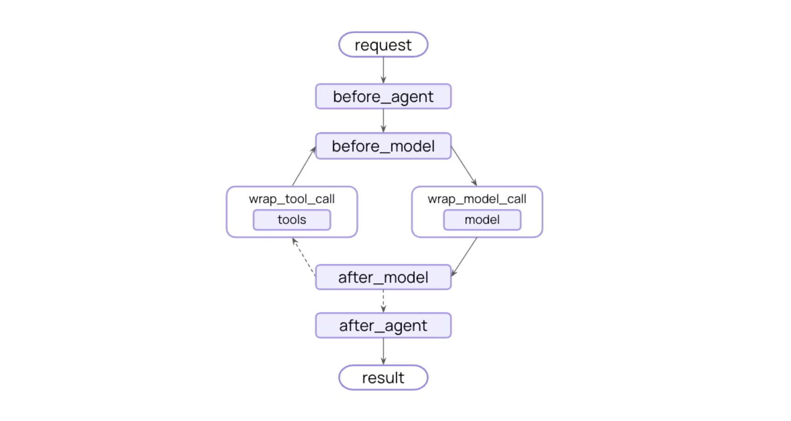

# LangChain Middleware

## 概述

中间件提供了一种更严格控制代理内部发生事情的方法。中间件适用于以下用途：

- 通过日志记录、分析和调试跟踪代理行为。
- 变换 prompt 提示，工具选择，以及输出格式。
- 添加 重新生成 ，多重方案 以及早期终止逻辑。
- 提供 速率限制 等保护机制，以及 PII检测。

通过传递中间件来添加 `create_agent`:

```python
from langchain.agents import create_agent
from langchain.agents.middleware import SummarizationMiddleware, HumanInTheLoopMiddleware

agent = create_agent(
    model="gpt-4.1",
    tools=[...],
    middleware=[
        SummarizationMiddleware(...),
        HumanInTheLoopMiddleware(...)
    ],
)
```

中间件在每一步之前和之后都暴露了钩子：




## Prebuilt middleware 预构建中间件

#### 通用中间件

以下中间件适用于任何大型语言模型提供商：

|      中间件       |                      描述                      |
| :---------------: | :--------------------------------------------: |
|   Summarization   |      接近 token 限制时自动总结对话记录。       |
| Human-in-the-loop |         暂停执行以供人工批准工具调用。         |
| Model call limit  |       限制模型调用次数，以防止过高成本。       |
|  Tool call limit  |        通过限制呼叫次数来控制工具执行。        |
|  Model fallback   |     当主模式失败时，会自动回退到其他模式。     |
|   PII detection   |        检测并处理个人身份信息（PII）。         |
|    To-do list     |       为客服人员配备任务规划和跟踪能力。       |
| LLM tool selector |    在调用主模型之前，先用LLM选择相关工具。     |
|    Tool retry     |       用指数后退自动重试失败的工具调用。       |
|    Model retry    |     自动用指数退回方式重试失败的模型调用。     |
| LLM tool emulator |         用LLM模拟工具执行以进行测试。          |
|  Context editing  |    通过修剪或清理工具使用来管理对话上下文。    |
|    Shell tool     | 向 agent 开放一个持久的 shell 会话以执行命令。 |
|    File search    |  在文件系统文件上提供 Glob 和 Grep 搜索工具。  |
|    Filesystem     | 为 agent 提供存储上下文和长期记忆的文件系统。  |
|     Subagent      |           增加生成子 agent 的能力。            |


#### Summarization 摘要

当接近令牌限制时自动总结对话历史，保留近期消息同时压缩旧上下文。摘要适用于以下情况：

- 长时间的对话超出上下文窗口。
- 多回合对话，历史悠久。
- 在保持完整对话上下文的重要应用中。

```python
from langchain.agents import create_agent
from langchain.agents.middleware import SummarizationMiddleware

agent = create_agent(
    model="gpt-4.1",
    tools=[your_weather_tool, your_calculator_tool],
    middleware=[
        SummarizationMiddleware(
            model="gpt-4.1-mini",
            trigger=("tokens", 4000),  # 触发摘要的条件。可以是：
            # fraction（float）：模型上下文大小的比例（0-1） | tokens（内文）：绝对代币计数 | messages（内文）：消息数量 |至少必须指定一个条件。如果不提供，摘要不会自动触发。
            keep=("messages", 20),  # 总结后应保留多少上下文。具体指定以下之一：
            # fraction（float）：模型上下文大小的比例（0-1） | tokens（内文）：绝对的代币数量 | messages（int）：需要保留的最近消息数量
            summary_prompt="",  # 自定义提示模板用于摘要。如果未指定，则使用内置模板。
        ),
    ],
)
```


#### Human-in-the-loop  人机交互

在执行工具调用前，暂停执行，以便人工批准、编辑或拒绝。人机交互适用于以下情况：

- 需要人工批准的高风险作（例如数据库写入、金融交易）。
- 必须有人监督的合规工作流程。
- 长期对话，人工反馈引导经纪人。

```python
from langchain.agents import create_agent
from langchain.agents.middleware import HumanInTheLoopMiddleware
from langgraph.checkpoint.memory import InMemorySaver

def read_email_tool(email_id: str) -> str:
    """Mock function to read an email by its ID."""
    return f"Email content for ID: {email_id}"

def send_email_tool(recipient: str, subject: str, body: str) -> str:
    """Mock function to send an email."""
    return f"Email sent to {recipient} with subject '{subject}'"

agent = create_agent(
    model="gpt-4.1",
    tools=[your_read_email_tool, your_send_email_tool],
    checkpointer=InMemorySaver(),
    middleware=[
        HumanInTheLoopMiddleware(
            interrupt_on={
                "your_send_email_tool": {
                    "allowed_decisions": ["approve", "edit", "reject"],
                },
                "your_read_email_tool": False,
            }
        ),
    ],
)
```


#### Shell tool 命令行工具

向 agent 开放一个持久的壳会话以执行命令。Shell 工具中间件适用于以下用途：

- 需要执行系统命令的 agent
- 开发与部署自动化任务
- 测试与验证工作流程
- 文件系统作与脚本执行

```python
from langchain.agents import create_agent
from langchain.agents.middleware import (
    ShellToolMiddleware,
    HostExecutionPolicy,
)

agent = create_agent(
    model="gpt-4.1",
    tools=[search_tool],
    middleware=[
        ShellToolMiddleware(
            workspace_root="/workspace",  # shell 会话的基础目录。
            execution_policy=HostExecutionPolicy(), # 执行策略控制超时、输出限制和资源配置。
            # startup_commands 会话开始后顺序执行的可选命令(比如进入环境)
            # shutdown_commands 会话关闭前执行的可选命令(比如释放资源)
        	# shell_command 可选的shell可执行文件或参数用于启动持久会话。默认为/bin/bash。
        	# env 可选的环境变量可以提供给shell会话。命令执行前，数值会被强制到字符串中。
        ),
    ],
)
```


#### File search

在文件系统上提供 Glob 和 Grep 搜索工具。文件搜索中间件适用于以下用途：

- 代码探索与分析
- 按名称模式查找文件
- 使用正则表达式搜索代码内容
- 需要文件发现的大型代码库

```python
from langchain.agents import create_agent
from langchain.agents.middleware import FilesystemFileSearchMiddleware

agent = create_agent(
    model="gpt-4.1",
    tools=[],
    middleware=[
        FilesystemFileSearchMiddleware(
            root_path="/workspace",  # 查找根目录
            use_ripgrep=True,  # 是否使用ripgrep进行搜索。如果ripgrep不可用，则会退回到Python正则表达式。
            # max_file_size_mb 最大搜索文件大小（MB）。比这个更大的文件会被跳过。
        ),
    ],
)
```


#### Subagent 子 agent

将任务交接给子代理可以隔离上下文，保持主 agent 的上下文窗口干净，同时仍深入任务。

子代理中间件来自 deep agent 允许你通过工具提供次级 agent。

```python
from deepagents.middleware.subagents import SubAgentMiddleware

agent = create_agent(
    model="1",
    middleware=[
        SubAgentMiddleware(
            default_model="2",
            default_tools=[],
            subagents=[
                {
                    "name": "weather", "description": "", "system_prompt": "",
                    "tools": [], "model": "3",
                    "middleware": [],
                }
            ],
        )
    ],
)
```

subagent 通过**名称**、**描述**、**系统提示**符和**工具**定义。你也可以提供带有自定义**模型**或额外**中间件**的子代理。当你想给子代理一个额外的状态密钥以与主 agent 共享时，这尤其有用。


## Custom middleware 自定义中间件

中间件提供了两种类型的钩子来拦截代理执行：

#### Node-style hooks 节点式钩子

在特定执行点顺序运行。用于日志记录、验证和状态更新。可用钩子：

- `before_agent`- agent 开始前（每次调用一次）
- `before_model`- 每次模型调用前
- `after_model`- 每次模型响应后
- `after_agent`- agent 完成后（每次调用一次）

```python
from langchain.agents.middleware import before_model, after_model, AgentState
from langchain.messages import AIMessage
from langgraph.runtime import Runtime
from typing import Any

@before_model(can_jump_to=["end"])
def check_message_limit(state: AgentState, runtime: Runtime):
    if len(state["messages"]) >= 50:
        return {
            "messages": [AIMessage("Conversation limit reached.")],
            "jump_to": "end"
        }
    return None

@after_model
def log_response(state: AgentState, runtime: Runtime):
    print(f"Model returned: {state['messages'][-1].content}")
    return None
```


#### Wrap-style hooks 缠绕式钩子

当调用处理程序时，拦截执行和控制。用于重试、缓存和转换。你决定调用处理器是零次（短路）、一次（正常流）还是多次（重试逻辑）。可用钩子：

- `wrap_model_call`- 围绕每个模型调用
- `wrap_tool_call`- 围绕每个工具调用

```python
from langchain.agents.middleware import wrap_model_call, ModelRequest, ModelResponse
from typing import Callable


@wrap_model_call
def retry_model(request: ModelRequest, handler: Callable[[ModelRequest], ModelResponse],):
    for attempt in range(3):
        try:
            return handler(request)
        except Exception as e:
            if attempt == 2: raise
            print(f"Retry {attempt + 1}/3 after error: {e}")
```


#### Decorator-based middleware 基于装饰器的中间件

单钩中间件快速简单。使用装饰师来包裹各个功能。

**节点风格：**

- `@before_agent` - 在代理开始前运行（每次调用一次）
- `@before_model` - 在每次模型调用前运行
- `@after_model` - 每次模型响应后运行
- `@after_agent` - 在代理完成后运行（每次调用一次）

**缠绕式：**

- `@wrap_model_call` - 用自定义逻辑包裹每个模型调用
- `@wrap_tool_call` - 用自定义逻辑封装每个工具调用

**便利性：**

- `@dynamic_prompt` - 生成动态系统提示

**何时使用装饰器模式：**

- 需要单钩
- 无复杂配置
- 快速原型制作


#### Class-based middleware 基于类的中间件

对于拥有多个钩子或配置的复杂中间件来说，功能更强大。当你需要为同一钩子定义同步和非同步实现，或者想在单一中间件中合并多个钩子时，可以使用类。

```python
from langchain.agents.middleware import (
    AgentMiddleware, AgentState,
    ModelRequest, ModelResponse,
)
from langgraph.runtime import Runtime
from typing import Any, Callable

class LoggingMiddleware(AgentMiddleware):
    def before_model(self, state: AgentState, runtime: Runtime) -> dict[str, Any] | None:
        print(f"输入模型的有 {len(state['messages'])} 条信息")
        return None

    def after_model(self, state: AgentState, runtime: Runtime) -> dict[str, Any] | None:
        print(f"模型回复内容: {state['messages'][-1].content}")
        return None

agent = create_agent(
    model="gpt-4.1",
    middleware=[LoggingMiddleware()],
    tools=[...],
)
```

**何时使用类模式：**

- 为同一钩子定义同步和异步实现
- 单个中间件需要多个钩子
- 需要复杂的配置（例如，可配置阈值、自定义模型）
- 在项目间重复使用初始时间配置


#### 自定义状态模式

中间件可以通过自定义属性扩展代理状态。这使得中间件能够：

- **跨执行跟踪状态**：维护计数器、标志或其他在整个执行生命周期中持续存在的值
- **在钩子之间共享数据**：将信息从`before_model`传递到`after_model`或不同中间件实例之间
- **实现跨领域关注点**：添加速率限制、使用跟踪、用户上下文或审计日志等功能，而无需修改核心代理逻辑
- **做出有条件决策**：利用累积状态决定是否继续执行、跳转到不同节点或动态修改行为

```python
from langchain.agents import create_agent
from langchain.messages import HumanMessage
from langchain.agents.middleware import AgentState, before_model, after_model
from typing_extensions import NotRequired
from typing import Any
from langgraph.runtime import Runtime

class CustomState(AgentState):
    model_call_count: NotRequired[int]
    user_id: NotRequired[str]

@before_model(state_schema=CustomState, can_jump_to=["end"])
def check_call_limit(state: CustomState, runtime: Runtime) -> dict[str, Any] | None:
    count = state.get("model_call_count", 0)
    if count > 10:
        return {"jump_to": "end"}
    return None

@after_model(state_schema=CustomState)
def increment_counter(state: CustomState, runtime: Runtime) -> dict[str, Any] | None:
    return {"model_call_count": state.get("model_call_count", 0) + 1}

agent = create_agent(
    model="gpt-4.1",
    middleware=[check_call_limit, increment_counter],
    tools=[],
)
```


#### 实例

###### 工具调用监控

```python
@wrap_tool_call
def monitor_tool(
    request: ToolCallRequest,
    handler: Callable[[ToolCallRequest], ToolMessage | Command],
) -> ToolMessage | Command:
    print(f"Executing tool: {request.tool_call['name']}")
    print(f"Arguments: {request.tool_call['args']}")
    try:
        result = handler(request)
        print(f"Tool completed successfully")
        return result
    except Exception as e:
        print(f"Tool failed: {e}")
        raise
```


###### 动态选择工具

```python
@wrap_tool_call
def monitor_tool(
    request: ToolCallRequest,
    handler: Callable[[ToolCallRequest], ToolMessage | Command],
) -> ToolMessage | Command:
    print(f"Executing tool: {request.tool_call['name']}")
    print(f"Arguments: {request.tool_call['args']}")
    try:
        result = handler(request)
        print(f"Tool completed successfully")
        return result
    except Exception as e:
        print(f"Tool failed: {e}")
        raise
```

